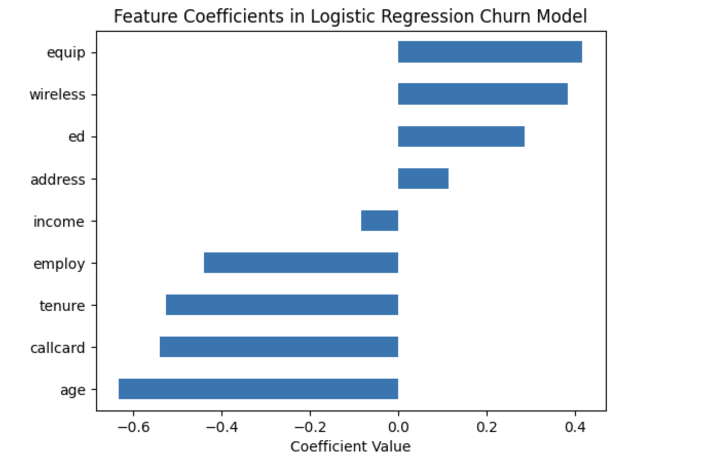

# Data-Science-Portfolio

Welcome to my Data Science Portfolio 👩🏻‍💻.

This repository showcases a collection of projects that highlight my skills in **data analysis, machine learning, and model evaluation**.

## 📂 Project Categories  

- **Python**

[**PJM Hourly Energy Consumption EDA & Forecasting**](machine-learning/Energy_Consumption_EDA%20_Forecasting/Energy_Consumption_EDA%20_Forecasting%20.ipynb)

Tools & Methods:: Python (pandas, matplotlib, seaborn, scikit-learn) · Exploratory Data Analysis · Data Visualization · Time Series Forecasting · Feature Engineering

This project explores and forecasts electricity demand using PJM hourly energy consumption data.  

**Distribution of Load by Region**  

**East MW Forecast vs Actual (First 14 Days)**  
.png)

[**Customer Churn Prediction with Logistic Regression**](machine-learning/customer-churn-logistic-regression/Customer%20Churn%20Prediction.ipynb)  
Tools & Methods: Python (scikit-learn) · Logistic Regression · Model Evaluation · Feature Tuning

Developed a predictive model for telecom customer churn. Includes feature fine-tuning, coefficient interpretation, and model evaluation using log loss. Demonstrates ability to link predictive modeling to business strategy and customer retention.  

  

- **R**

[**Policy Barriers to College: Analyzing In-State Tuition Access for Undocumented Youth**](R/Logistic%20Regression%20Analysis%20of%20Education%20%26%20Employment%20Data/2023_log_regression.pdf)

Tools & Methods: R (survey package, dplyr, ggeffects, ggplot2); Survey-weighted logistic regression (`svyglm`); Data cleaning, policy variable construction, predictive modeling

This project is part of my work with the American Immigration Council and examines how state-level policies — specifically, in-state tuition eligibility and driver’s license access — influence college attendance rates among undocumented youth in the United States. Using 2023 American Community Survey (ACS) microdata, I construct a logistic regression model to estimate how these policies, along with demographic and economic factors, shape postsecondary enrollment outcomes.

- **SQL**

[**SpaceX Falcon 9 Launch Analysis**](SQL/SpaceX_EDA)

Skills: SQL · Exploratory Data Analysis
Conducted exploratory data analysis (EDA) on SpaceX Falcon 9 launch records using SQL to assess launch frequency, success rates, and performance metrics. 

---

✨ More projects will be added as I continue expanding this portfolio.  
